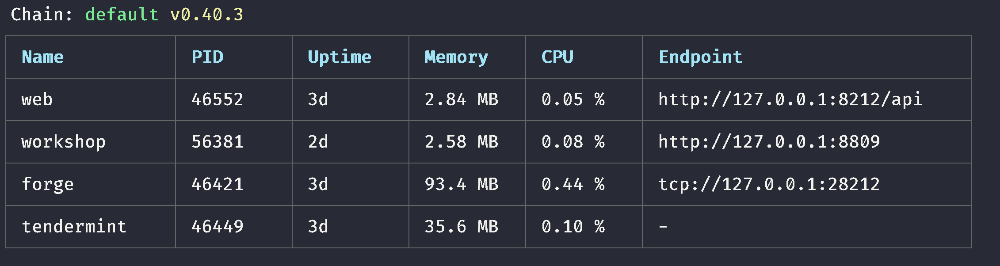

# Java-SDK

## Forge-java-sdk

forge sdk for java development.
For Forge-related setup, please checkout [Forge](https://github.com/ArcBlock/forge)

A detailed reference manual for forge-java-sdk can be found [here](https://docs.arcblock.io/forge/sdks/java/).

## Installation

if you are using gradle ,you have to add url to your repositories

```gradle
 repositories {
      maven { url "http://android-docs.arcblock.io/release" }
 }

 dependencies {
     implementation("io.arcblock.forge:core:${forge_version}")
     implementation 'io.grpc:grpc-netty:1.20.0'
 }
```

and java version must >= 8.

## Usage

### Step 0

First get your Forge running on local with [Forge CLI](../../tools/forge_cli).
Or you know another's node config info.

### Step 1

Find the config your forge is using by `forge ps`, find forge section, and get endpoint.



## Tutorials

### Step 0: create a project.

Create a SpringBoot gradle project. and ZX forge-java-sdk to it's dependencies.

```bash
brew install springboot
spring init --build=gradle --language=kotlin {project_name}
```

### Step 1: connect to Forge Node.

```kotlin
val forge = ForgeSDK.connect("localhost",28210)
```

when you want to connect with forge node.

### Step 2: create a wallet.

```kotlin
val chainInfo = forge.getChainInfo().info //get chain info
val alice = forge.createWallet()
forge.declare("Alice",alice)
```

you have to declare your account like sign up your account on chain.

### Step 3: Query your account information.

```kotlin
// create a stream to listen account state
val accountRequest = forge.getAccountState(object : StreamObserver<ResponseGetAccountState> {
	override fun onNext(value: ResponseGetAccountState?) {
		logger.info("\nAccountState balance:\n${BigInteger(value?.state?.balance?.unSign?.value?.toByteArray())}")
	}
	override fun onError(t: Throwable?) {}
	override fun onCompleted() {}
	})
	accountRequest.onNext(RequestGetAccountState.newBuilder().setAddress(alice.address).build())
```

this interface is a gRPC stream

### Step 4: CheckIn/Poke your wallet to get some token.

```kotlin
forge.poke(alice)
Thread.sleep(5000) //wait for block to commit
accountRequest.onNext(RequestGetAccountState.newBuilder().setAddress(alice.address).build())
```

wait some seconds, check your account balance .

### Step 5: Transfer your token to other.

create another wallet (suppose: Bob) as step 2.

```kotlin
//create a transfer tx and send
forge.transfer(alice, bob.address, BigDecimal("2E18").toBigInteger())
```

if it works, response will return a hash string. you can query this hash use forgeSDK,or query it in forgeWeb. After this tx confirmed, check Alice and Bob 's accounts to confirm if this transaction successfully.

## More usage

### Create wallet by existing private key

```kotlin
val wallet = WalletInfo.fromSk(yourPrivateKey)
```

### Sign a transaction

```kotlin
//create inner transaction ,you can custom inner transaction by custom protocol
val innerTx = Transfer.TransferTx.newBuilder()
		.setValue(Type.BigUint.newBuilder().setValue("100".toByteArray().toByteString()))
    .build()
//create transaction
transaction = TransactionFactory.createTransaction(chanId = "forge",from = alice.address, pk = alice.pk,itx = innerTx.toByteString(), typeUrl = TypeUrls.TRANSFER)
//sign a transaction
val tx = transaction.signTx(alice.sk) //In java : TransactionExtKt.signTx(transaction, alice.sk)
//send a transaction
val response = forge.sendTx(tx)
```

### MultiSig a transaction

[What is Multisig?](https://docs.arcblock.io/en/docs/intro/concepts/multisig)

```kotlin
//inner transaction need multiSig
val exchange = Exchange.ExchangeTx.newBuilder()
        .setSender(Exchange.ExchangeInfo.newBuilder()
          .setValue(Type.BigUint.newBuilder()
            .setValue(fromToken.toByteArray().toByteString())
            .build())
          .build())
        .setReceiver(Exchange.ExchangeInfo.newBuilder()
          .addAssets(assetAddress)
          .build())
        .setTo(delegateeTo ?: to)
        .build()
//create exchange tranaction and sender sign it
var transaction = TransactionFactory.createTransaction(chainId, from.address, from.pk, exchange.toByteString(), TypeUrls.EXCHANGE).signTx(from.sk)

//multiSig this transaction
transaction = transaction.multiSig(toWallet)

```

`What MultiSig actually do`

```kotlin
// create a multiSig instance by wallet
val multisigBuilder = Type.Multisig.newBuilder()
    .setPk(wallet.pk.toByteString())
    .setSigner(wallet.address)
    .setData(data ?: Any.getDefaultInstance())
		.setSigner(wallet.address)
// add multiSig to origin transaction
val transaction = originTx.toBuilder().addSignatures(0, multisigBuilder.build()).build()
// sign tx.
val sig = Signer.sign(wallet.getSignType(), Hasher.hash(wallet.getHashType(), transaction.toByteArray()), wallet.sk)
val multiSig = multisigBuilder.setSignature(sig.toByteString()).builder()
// add multiSig to origin transaction ,then send it.
val finalTx = originTx.toBuilder().addSignatures(0, multiSig).build()

```

### Asset

[What's asset](https://docs.arcblock.io/en/docs/reference/txs/asset/create_asset)

create asset: response is send transaction response and address is asset address, if transaction send successfully

```kotlin
val (response, address) = forge.createAsset("your asset binary type", assetBinary, "assetMoniker", wallet)
```

common consume asset: if asset creator sell asset to others ,and others want to consume asset

```kotlin
val response = forge.consumeAsset(assetAddress, assetCreator , assetOwner)
```

child account consume asset: if application want others to check asset.

```kotlin
//create pre Tx for ticket owner to multiSign and consume asset
val preTx = TransactionFactory.preConusmeAsset(forge.chainInfo.value.network, gateKeeper, issuer.address)

//consume multiSig tx
val finalTx = TransactionFactory.finalizeMultiSig(preTx, consumer, data = Any.newBuilder()
      .setValue(address.toByteArray().toByteString())
      .setTypeUrl(TypeUrls.CONSUME_ASSET_ADDRESS)
      .build())

//send tx ,you can check it at
val rsp = forge.sendTx(finalTx)
```

### Delegation

[What's delegation](https://docs.arcblock.io/en/docs/reference/txs/account/delegate)

```kotlin
// Alice create a delegation to Bob, rules is limit string, such as 'itx.value < 100',then
// If transfer value is more than 100, Bob signed transfer will fail
var response = forge.createDelegate(from = alice, to = bob, rules= listOf(), typeUrl)

//create a transfer transaction by Bob
var transferTx = TransactionFactory.unsignTransfer("forge",bob.address, bob.pk, "otherAddress", BigInteger.TEN.unSign())

//set a delegatee an then signed by Bob
transferTx = transferTx.delegatee(alice).signTx(Bob.sk)

//send tx , and alice balance reduce
val response = forge.sendTx(transferTx)
```

::: tip
**TBA** is the default currency on Forge Chain. 1 TBA has 18 digits, so it shows as `1000000000000000000`.
and decimal is 18.
:::

## For java user

Java user can use kotlin object like below:

```java
ForgeSDK.Companion.connect("localhost",28210)
```

and use kotlin extention like below:

```
TransactionExtKt.multiSig(tx, alice)
```

🎉 Congratulations! You have finished the tutorial! Now you should have a general sense about how Forge works. Now continue to explore !
[simple demo project](https://github.com/ArcBlock/forge-java-sdk/blob/master/examples/src/main/java/com/example/demo/DemoApplication.kt)

## Welcome contribution

Want to contribute? Great! First, read this page

### Setup Develop Environment

first, you have to install [forge-cli](https://docs.arcblock.io/forge/latest/tools/forge_cli.html) and setup a local chain.

make sure you have installed java ,make and ktlint.

clone this Repo. and open terminal in this Repo. run:

```shell

make build

//if you want update protobuf, run first
make download-proto
make genForgeSDK

```

it will start a SpringBoot example.

```shell
curl http://localhost:8081/
```

and it will return forge info.

Now, you can add your code to this project and feel free to create request pull or issue .

### Code reviews

All submissions, including submissions by project members, require review. We
use GitHub pull requests for this purpose.

Before you commit your code ,please run `make test` to make sure all test is passed. and there is a pre-commit to check kotlin code.

Thank you for considering contributing, and feel free to contribute .
